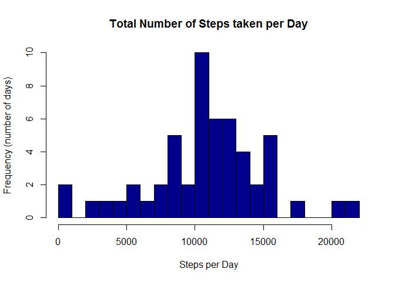
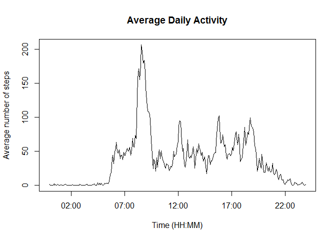
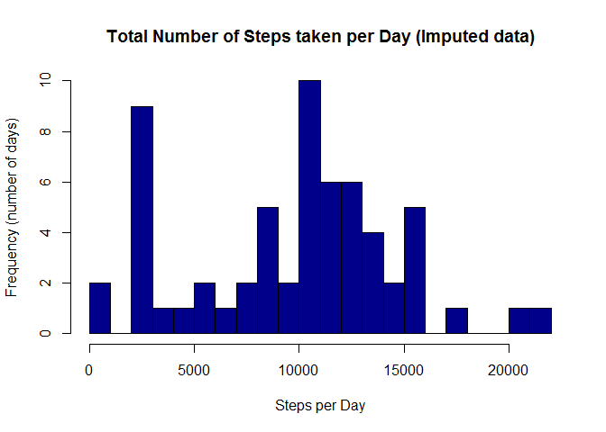
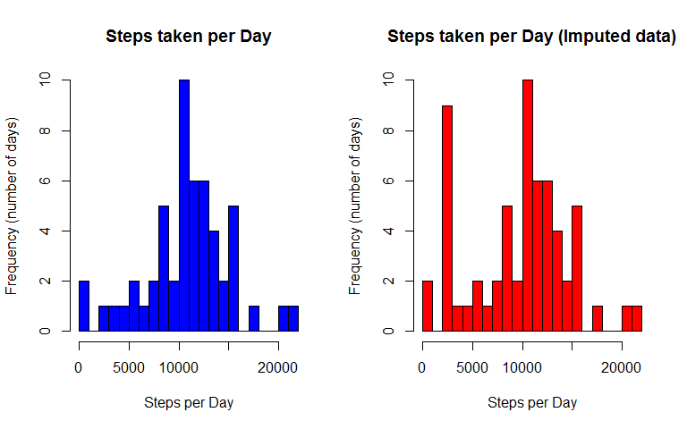
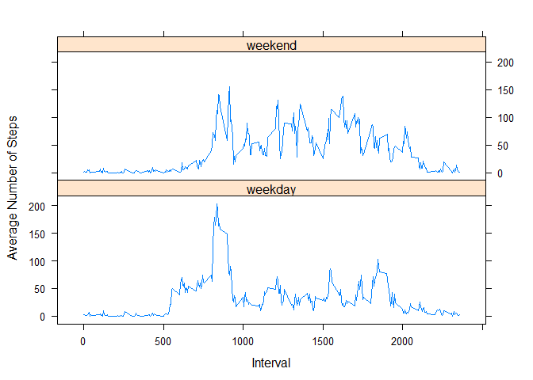

# Reproducible Research: Peer Assessment 1


```r
library(ggplot2)
library(lattice)
library(dplyr)
library(knitr)
opts_chunk$set(echo=TRUE)
```

## Loading and preprocessing the data

```r
if(!file.exists('activity.csv')){
    unzip('activity.zip')
}
data <- read.csv("activity.csv")
head(data)
```

```
##   steps       date interval
## 1    NA 2012-10-01        0
## 2    NA 2012-10-01        5
## 3    NA 2012-10-01       10
## 4    NA 2012-10-01       15
## 5    NA 2012-10-01       20
## 6    NA 2012-10-01       25
```

## What is mean total number of steps taken per day?

```r
datasteps <- na.omit(data)
datasteps <- tapply(datasteps$steps, datasteps$date, FUN = sum, na.rm = TRUE)
hist(datasteps,
     main = "Total Number of Steps taken per Day", 
     xlab = "Steps per Day", 
     ylab = "Frequency (number of days)", 
     breaks=20,   col = "darkblue")
```

 

```r
rmean <- mean(datasteps, na.rm = TRUE)
rmedian <- median(datasteps, na.rm = TRUE)
```

Mean of total number of steps per day = 1.0766189\times 10^{4}  
Median = 10765

## What is the average daily activity pattern?


```r
avginterval <- data %>%
               group_by(interval) %>%
               summarize(steps = mean(steps, na.rm = TRUE))

plot(strptime(sprintf("%04d", avginterval$interval), format="%H%M"),
     avginterval$steps, type = "l", 
     main = "Average Daily Activity", 
     xlab = "Time (HH:MM)", 
     ylab = "Average number of steps")
```

 

```r
rmaxsteps <- which.max(avginterval$steps)
rmax <- gsub("([0-9]{1,2})([0-9]{2})", "\\1:\\2", avginterval[rmaxsteps,'interval'])
```

Time with the most steps: 8:35  (24 hours time)

## Imputing missing values

#### 1. Calculate and report the total number of missing values in the dataset

```r
sum(is.na(data))
```

```
## [1] 2304
```
#### 2. Devise a strategy for filling in all of the missing values in the dataset. The strategy does not need to be sophisticated. For example, you could use the mean/median for that day, or the mean for that 5-minute interval, etc  

#### 3. Create a new dataset that is equal to the original dataset but with the missing data filled in.
The chosen strategy is to use the most frequent activity or the low label one for that 5-minute interval to fill each NA value in the steps column


```r
fullData <- data
cdata <- plyr::ddply(na.omit(fullData), c("interval", "steps"), summarise,
               N    = length(steps))
cdata <- cdata[cdata$steps!=0,]
for (i in 1:nrow(fullData)) {
    if (is.na(fullData$steps[i])) {
        if(fullData$interval[i] %in% cdata$interval) {
            wmax <- cdata[cdata$interval==fullData$interval[i],]
            fullData$steps[i] <- wmax[1,]$steps # fill with most common activitity for this interval
        } else {
            fullData$steps[i] <- 0 # fill with default value (0)
        }
    }
}
```

New Dataset : fullData (dim=17568, 3)  
Missing Values : 0  

### 4. Make a histogram of the total number of steps taken each day and Calculate and report the mean and median total number of steps taken per day


```r
datastepsFULL <- tapply(fullData$steps, fullData$date, FUN = sum)
hist(datastepsFULL,
     main = "Total Number of Steps taken per Day (Imputed data)", 
     xlab = "Steps per Day", 
     ylab = "Frequency (number of days)", 
     breaks=20,   col = "darkblue")
```

 

```r
rmeanFULL <- mean(datastepsFULL)
rmedianFULL <- median(datastepsFULL)
```

##### Dataset with Imputed missing values
Mean of total number of steps per day = 9710.295082  
Median = 1.0395\times 10^{4}

#### 4b. Do these values differ from the estimates from the first part of the assignment? What is the impact of imputing missing data on the estimates of the total daily number of steps?


```r
par(mfrow=c(1,2))
hist(datasteps,
     main = "Steps taken per Day", 
     xlab = "Steps per Day", 
     ylab = "Frequency (number of days)", 
     breaks=20,   col = rgb(0,0,1,1))

hist(datastepsFULL,
     main = "Steps taken per Day (Imputed data)", 
     xlab = "Steps per Day", 
     ylab = "Frequency (number of days)", 
     breaks=20,   col = rgb(1,0,0,1))
```

 

 
## Are there differences in activity patterns between weekdays and weekends?

#### Make a panel plot containing a time series plot (i.e. type = "l") of the 5-minute interval (x-axis) and the average number of steps taken, averaged across all weekday days or weekend days (y-axis)


```r
fullData$dType<-ifelse(as.POSIXlt(fullData$date)$wday %in% c(0,6), 'weekend', 'weekday')
avgActivity <- aggregate(steps ~ interval + dType, data=fullData, mean)

xyplot(steps~interval|dType, data=avgActivity, type="l",  layout = c(1,2),
       ylab="Average Number of Steps", xlab="Interval")
```

 

